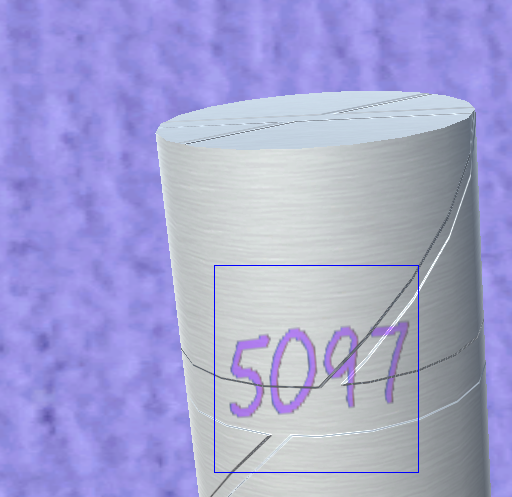

# 概要
Unityを用いたデータセット作成のためのサンプルコード。

ランダムな文字の３次元オブジェクトへの貼り付けとその画面上の位置の取得を行う。

# 操作方法

- 左クリック: 文字の投射
- 右クリック: 文字の消去
- Fキー: カメラ位置のランダム移動
- Sキー: 画面の保存 (screen.pngに保存される)
- Bキー: 文字位置の保存 (back.pngとbbox.pngに保存される)

# ビルド
System.DrawingをUnity\Editor\Data\Mono\lib\mono\2.0からAssetsに配置する。

# 実装メモ
Main CameraのRendering PathをDeferredにするのを忘れないこと。

